
  
  <h1 align="center">Limekit Framework</h1>
  
Cross-platform lua GUI framework with built-in theme support

## 🎨 About

Limekit is the first cross-platform lua GUI framework featuring comprehensive theme support. Built on PySide6 (Qt) with lupa (lua bridge), it provides a pure lua API without requiring Python knowledge. The framework enables "write once, run anywhere" development for Windows, macOS, and Linux.

With Limekit, you dont need to compile anything on any Operating System (OS). Simply install python, the framework, and you are good to go.

## 📩 Contact

For any enquiry or feedback: omegamsiskah@gmail.com

## 🛠️ How It Works

Limekit's architecture consists of three key layers:

1. **Qt/PySide6 Base** - Provides native widgets and rendering
2. **Wrapped Widgets** - 40+ wrapper widgets for you
3. **lupa Bridge** - Exposes wrapped components to lua runtime

The [lupa engine](https://github.com/scoder/lupa) handles all lua/python interoperability, allowing your lua code to interact with Qt widgets seamlessly.

## ⚠️ Project Status Note

Limekit is currently under active development. Please note:

- The codebase is evolving and may undergo significant changes
- Architecture is being refined as the project matures
- Some advanced features are still in development

This project represents a passionate effort begun before the era of generative AI tools. While it may not reflect senior-level architecture patterns yet, it demonstrates innovative thinking and practical problem-solving in bridging lua with modern GUI frameworks.

## 🌟 Features

- **Pure lua API** - No Python knowledge needed
- **True cross-platform** - Single codebase for all desktop platforms
- **Advanced theming** - Material Design, Light/Dark modes, Fluent (coming soon)
- **Native performance** - Powered by Qt through PySide6
- **Complete toolkit** - Includes all essential widgets and layout managers
- **Integrated runtime** - Comes with Limer deployment tool

## 🚀 Examples

There are lots of examples you can check out to appreciate the framework
Check out https://github.com/mitosisX/limekit-demos

## 📚 Documentation

Head over to https://limekit.readthedocs.io/ for the installation process

## 🛠️ Requirements

- Python 3.10+ (for framework backend)
- Limer (for running your apps)
- Basic lua knowledge
- Urge to develop beautiful apps

## 📦 Installation

Download the Limer (required):

- Limer is the tool used to create and run any of your Limekit apps

- [Limer](https://github.com/mitosisX/Limer-Limekit)

## 🖼️ Showcase

  

    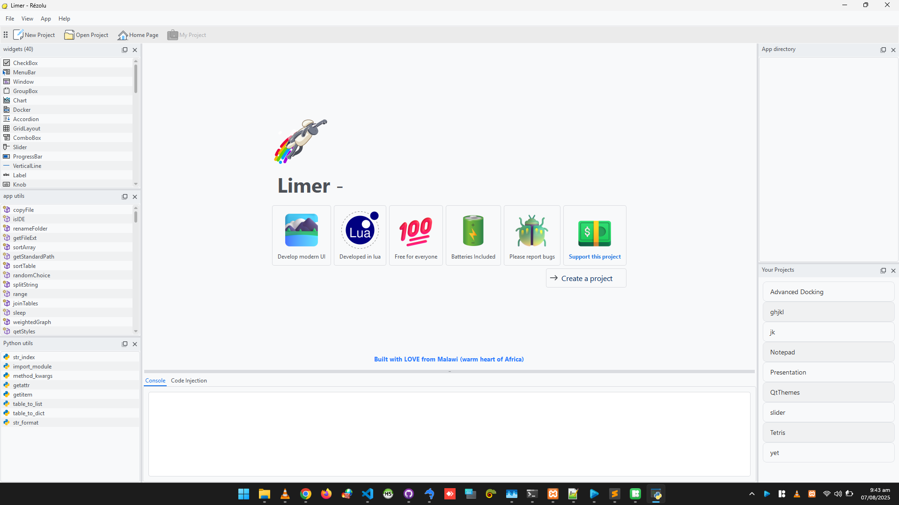 
    <!-- 
Material Light
 -->
  

  

    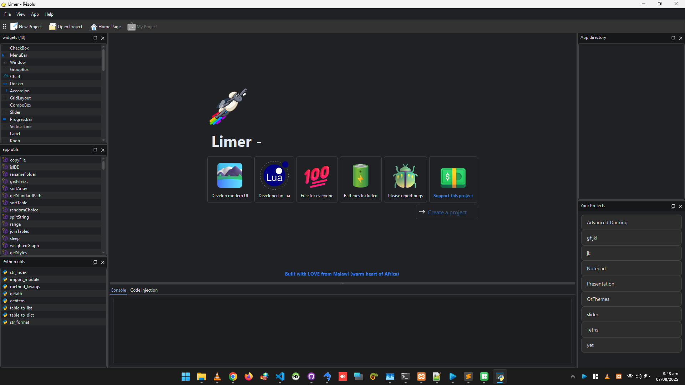 
  

  

    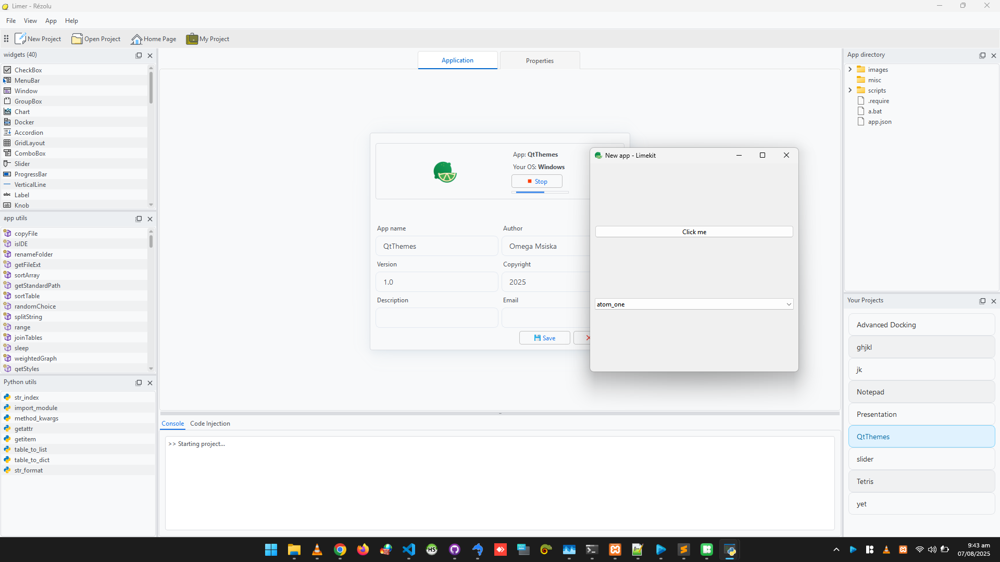 
  

  

    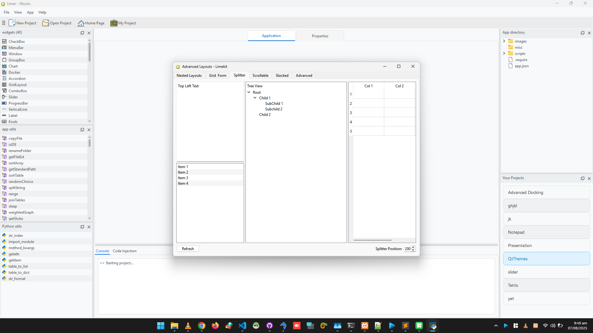 
  

  

     
  

  

    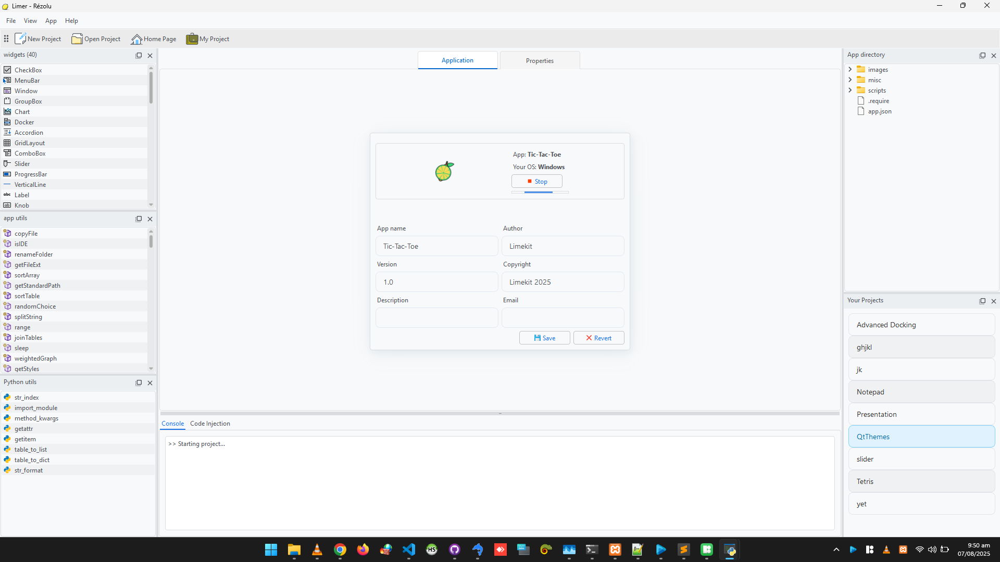 
  

  

    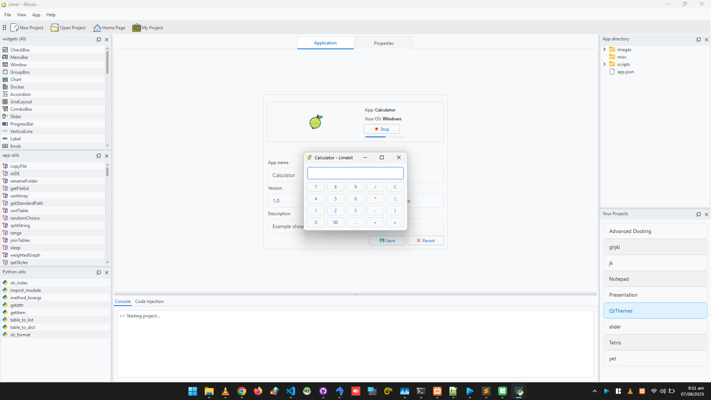 
  

  

    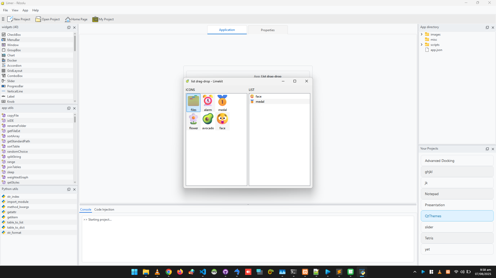 
  

  

    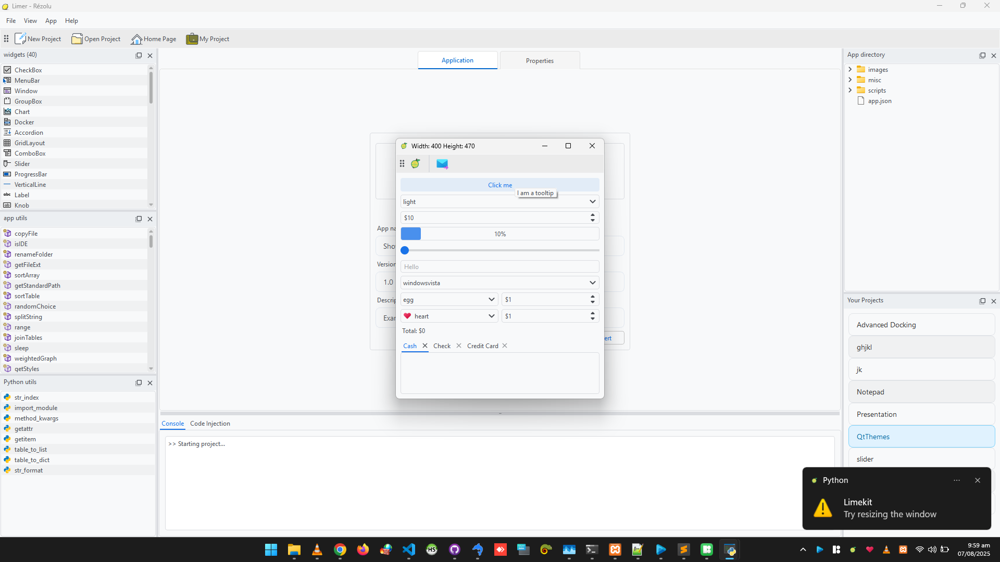 
  

  

    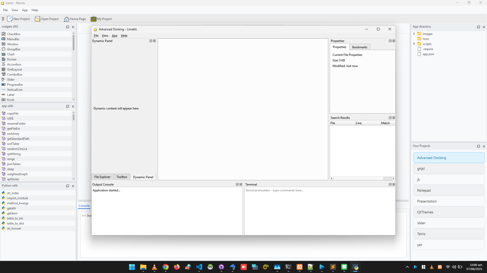 
  

  

    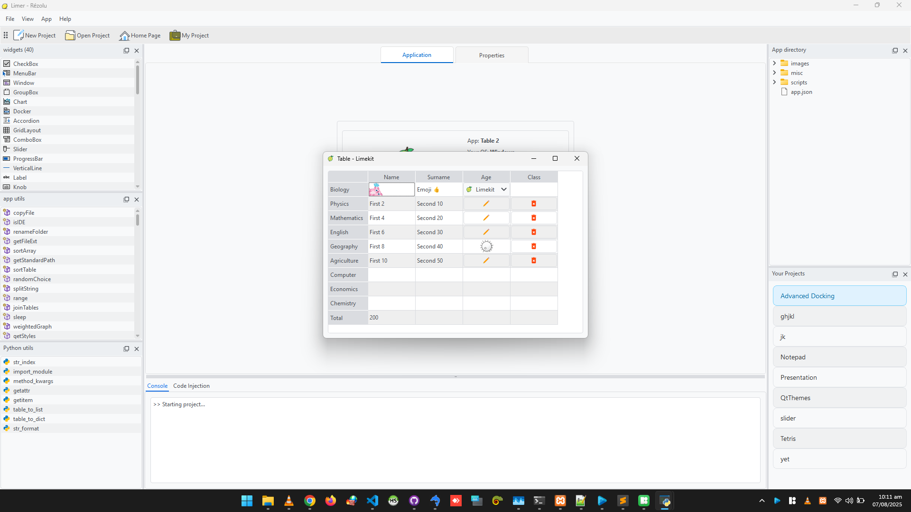 
  

  

    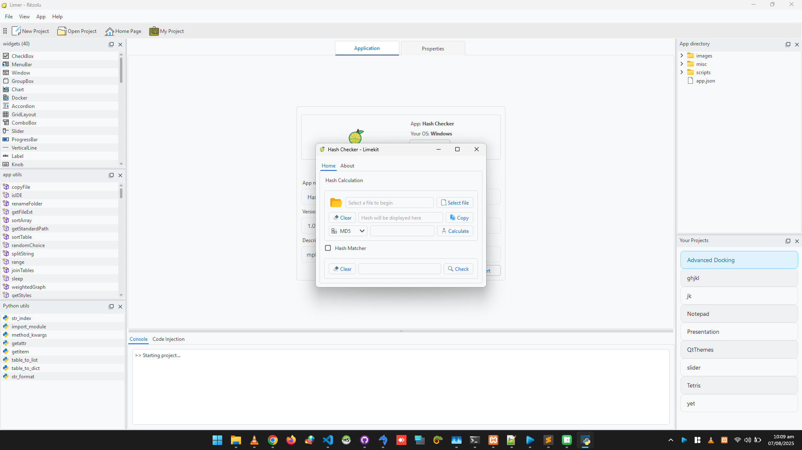 
  

## 🤝 Contributing

We welcome any contributions! Be it architectural change, refactoring, anything!

## 📜 License

Limekit is licensed under GPLv3

Copyright © 2025 by Rézolu.
