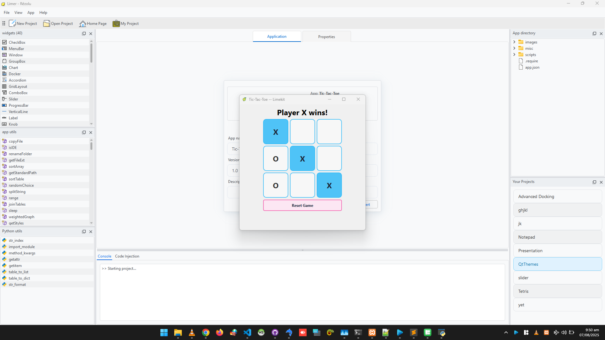

  
  <h1 align="center">Limekit Framework</h1>
  
Cross-platform lua GUI framework with built-in theme support

## About

Limekit is the first cross-platform lua GUI framework featuring comprehensive theme support. Built on PySide6 (Qt) with lupa (lua bridge), it provides a pure lua API without requiring Python knowledge. The framework enables "write once, run anywhere" development for Windows, macOS, and Linux.

## 🛠️ How It Works

Limekit's architecture consists of three key layers:

1. **Qt/PySide6 Base** - Provides native widgets and rendering
2. **Python Wrapper Layer** - 40+ wrapper classes exposing Qt functionality
3. **lupa Bridge** - Exposes wrapped components to lua runtime

The [lupa engine](https://github.com/scoder/lupa) handles all lua/Python interoperability, allowing your lua code to interact with Qt widgets seamlessly.

## ⚠️ Project Status Note

Limekit is currently under active development. Please note:

- The codebase is evolving and may undergo significant changes
- Architecture is being refined as the project matures
- Some advanced features are still in development

This project represents a passionate effort begun before the era of generative AI tools. While it may not reflect senior-level architecture patterns yet, it demonstrates innovative thinking and practical problem-solving in bridging lua with modern GUI frameworks.

## Features

- **Pure lua API** - No Python knowledge needed
- **True cross-platform** - Single codebase for all desktop platforms
- **Advanced theming** - Material Design, Light/Dark modes, Fluent (coming soon)
- **Native performance** - Powered by Qt through PySide6
- **Complete toolkit** - Includes all essential widgets and layout managers
- **Integrated runtime** - Comes with Limer deployment tool

## Documentation

Head over to https://limekit.readthedocs.io/ for the installation process

## Requirements

- Python 3.10+ (for framework backend)
- Limer
- Basic lua knowledge
- Urge to develop beautiful apps

## Installation

Download the Limer (required):

- [Limer](https://github.com/mitosisX/Limer-Limekit)

## 🖼️ Showcase

  

     
    <!-- 
Material Light
 -->
  

  

     
  

  

     
  

  

     
  

  

     
  

  

     
  

  

     
  

  

     
  

  

     
  

  

     
  

  

     
  

  

     
  

## 🤝 Contributing

We welcome any contributions! Be it architectural change, refactoring, anything!

## 📜 License

Limekit is licensed under GPLv3

Copyright © 2025 by Rézolu.
